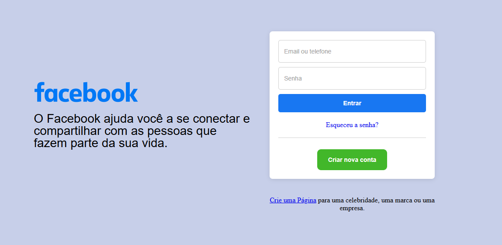

# Tela de Login - Inspirada no Facebook

Este projeto é uma tela de login responsiva inspirada no visual do Facebook. Ele foi desenvolvido com HTML e CSS, com foco em boas práticas e design adaptável para diferentes telas.



## 🚀 Tecnologias

- HTML5  
- CSS3  
- Responsividade com media queries

---

## 💻 Código HTML

```HTML
<!DOCTYPE html>
<html lang="pt-br">
<head>
  <meta charset="UTF-8">
  <meta name="viewport" content="width=device-width, initial-scale=1.0">
  <title>Tela de Login Facebook</title>
  <link rel="stylesheet" href="styles.css">
</head>
<body>
  <header class="wrapper">
    <div class="logo-container">
      
      <h2>O Facebook ajuda você a se conectar e compartilhar com as pessoas que fazem parte da sua vida.</h2>
    </div>
    <section>
      <div class="caixinha">
        <input placeholder="Email ou telefone" type="text" class="em">
        <input placeholder="Senha" type="password" class="sh">
        <button class="button">Entrar</button>
        <a class="ss" href="#">Esqueceu a senha?</a>
        <div class="linha"></div>
        <button class="new">Criar nova conta</button>
      </div>
      <a class="h4" href="#">Crie uma Página</a> para uma celebridade, uma marca ou uma <br>
      <span class="h4-span">empresa.</span>
    </section>
  </header>
</body>
</html>.
```

```CSS
* {
    margin: 0;
    padding: 0;
    box-sizing: border-box;
}

.wrapper {
    height: 100vh;
    width: 100vw;
    display: flex;
    justify-content: center;
    align-items: center;
    background-color: #c7cfe9;
    flex-direction: row;
    gap: 40px;
    flex-wrap: nowrap;
}

.logo-container {
    height: 52%;
    display: flex;
    flex-direction: column;
    align-items: flex-start;
    text-align: left;
    max-width: 500px;
    flex-grow: 1;
}

.logoFAc {
    width: 240px;
    margin-bottom: -30px;
    margin-top: 10px;
}

h2 {
    width: 100%;
    font-size: 28px;
    text-align: left;
    font-family: SFProDisplay-Regular, Helvetica, Arial, sans-serif;
    font-weight: 300;
    line-height: 28px;
    padding: 10px 0;
}

.caixinha {
    width: 100%;
    max-width: 400px;
    position: relative;
    display: flex;
    flex-direction: column;
    align-items: center;
    text-align: center;
    padding: 20px;
    border: none;
    border-radius: 7px;
    background-color: #fff;
    box-shadow: 0 2px 10px rgba(0, 0, 0, 0.1);
    flex-grow: 1;
    margin-bottom: 20px;
    top: -20px;
}

.sh,
.em {
    width: 100%;
    max-width: 348px;
    height: 52px;
    border-radius: 5px;
    border: 1px solid #cfcfcf;
    margin-bottom: 10px;
}

.sh::placeholder,
.em::placeholder {
    color: #a0a0a0;
    font-size: 14px;
    padding-left: 12px;
}

.button {
    width: 100%;
    max-width: 348px;
    height: 42px;
    border-radius: 5px;
    border: none;
    background-color: #1877f2;
    color: #fff;
    font-size: 14px;
    font-weight: bold;
    text-align: center;
    cursor: pointer;
    display: flex;
    justify-content: center;
    align-items: center;
    transition: background-color 0.3s;
}

.button:hover {
    background-color: #166fe5;
}

.linha {
    width: 100%;
    height: 1px;
    background-color: #cfcfcf;
    margin: 10px 0;
}

.new {
    width: 160px;
    height: 48px;
    border-radius: 9px;
    border: none;
    background-color: #42b72a;
    color: #fff;
    font-size: 14px;
    font-weight: bold;
    text-align: center;
    cursor: pointer;
    display: flex;
    justify-content: center;
    align-items: center;
    transition: background-color 0.3s;
    margin-top: 16px;
}

.new:hover {
    background-color: #36a420;
}

.ss {
    margin-top: 20px;
    margin-bottom: 10px;
    text-decoration: none;
}

h4 {
    width: 100%;
    font-size: 18px;
    font-weight: 300;
    color: #070606;
    text-decoration: none;
    text-align: center;
    margin-top: 50px;
    white-space: pre-line;
}

.h4-span {
    display: block;
    text-align: center;
}

/* MEDIA QUERIES */

/* Tablets */
@media (max-width: 943px) {
    .wrapper {
        flex-direction: column;
        overflow: hidden;
    }
    .logo-container {
        justify-content: center;
        align-items: center;
        text-align: center;
        max-width: 100%;
        margin-top: 2%;
    }
    .logoFAc {   /* deixar "Logo"  face lado da tela de login */
        width: 200px;
        height: 150px;
        margin-bottom: -22%;
        margin-top: -8%;
    }
    h2 {
        display: none;
    }
    .caixinha {
        width: 100%;
        max-width: 100%;
        padding: 35px 20px;
        align-items: center;
        justify-content: center;
        position: relative;
        margin: 0 auto;
        top: -12%;
    }
    h4 {
        font-size: 16px;
        margin-top: 10px;
        margin-bottom: 10px;
    }
}

/* Celulares pequenos */
@media (max-width: 499px) {
    .logoFAc {
        width: 280px;
        margin-bottom: 66%;
    }
}

/* Celulares específicos (ex: Galaxy A12, Moto G) */
@media (max-width: 412px) and (max-height: 915px) {
    .logoFAc {
        width: 280px;
        margin-bottom: -70%;
    }
    .caixinha {
        width: 90%;
        height: auto;
        padding: 42px 20px;
        margin-top: 150px;
        top: -32%;
    }
    h4 {
        font-size: 16px;
        margin: 10px 0;
    }
    .sh,
    .em {
        height: 48px;
        font-size: 14px;
    }
    .button,
    .new {
        height: 40px;
        font-size: 13px;
    }
}
```
__________________________________________________________________________________________________________________________________________

## 📱 Layout Responsivo

- ✅ Desktop  
- ✅ Tablet  
- ✅ Celulares (pequenos e médios)

## 🛠️ Como usar

1. Clone o repositório:
```bash
git clone https://github.com/nerddaprogramacao/projeto-facebooklogin.git

📁 projeto-facebooklogin
├── index.html
├── styles.css
├── /png
│   └── Facebook-Logo.png
└── README.md

📌 Status
🚧 Projeto em desenvolvimento para fins de aprendizado.

